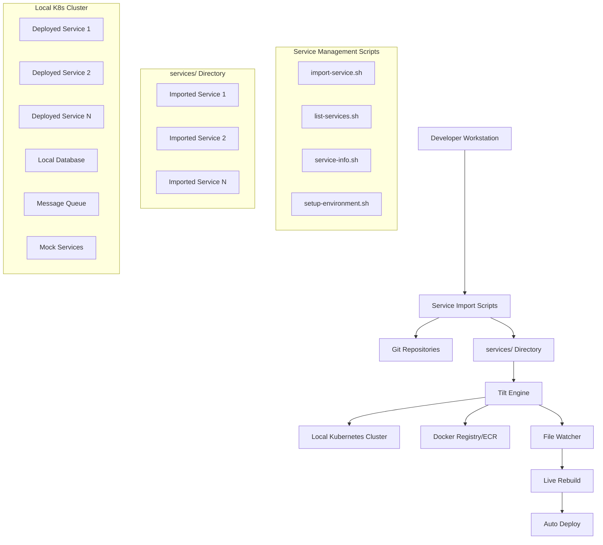

# Design Document

## Overview

The local development environment system is a **Service Import/Integration Platform** that uses Tilt as the orchestration layer to manage a local Kubernetes cluster where developers can import and deploy any combination of existing applications from various sources (Git repositories, local directories). The system supports Python, Java, Go, Node.js, CrewAI services, and more. It provides comprehensive automation for service discovery, import, configuration generation, and management through dedicated scripts. The system creates its own Kubernetes manifests specifically for local development, supports multiple image sources (ECR, local Docker, live builds), and organizes imported services in a structured `services/` directory. Since each developer runs their own local cluster, isolation is built-in by default.

## Architecture

### High-Level Architecture



### Component Architecture

1. **Service Import/Integration Platform**: Comprehensive system for importing and managing existing services
2. **Tilt Engine**: Central orchestrator managing builds, deployments, and monitoring for imported services
3. **Local Kubernetes Cluster**: Isolated environment using kind/k3d/Docker Desktop
4. **Service Management Scripts**: Automated tools for service import, discovery, configuration, and environment management
5. **services/ Directory Structure**: Organized storage for imported services with clear separation
6. **Local Kubernetes Manifests**: Creates development-specific Kubernetes manifests for imported services
7. **Image Management**: Handles ECR pulls, local builds, and Docker registry integration
8. **Service Discovery**: Kubernetes-native service discovery and networking

## Components and Interfaces

### Modular Architecture Benefits

The system follows a **modular architecture** with clear separation of concerns for enhanced maintainability:

**Key Benefits:**
- **Maintainability**: Each module handles a single responsibility (150 lines vs 1200+ monolithic)
- **Testability**: Individual modules can be tested in isolation
- **Collaboration**: Multiple developers can work on different modules simultaneously
- **Extensibility**: Easy to add new service types and features
- **Readability**: Clear module boundaries and focused functionality

### Modular Tilt Architecture

The Tilt configuration follows a modular architecture with clear separation of concerns for maintainability and scalability:

#### Main Tiltfile Structure
```python
# Main Tiltfile - Orchestration only (192 lines)
load('ext://namespace', 'namespace_create')
load('ext://configmap', 'configmap_create')
load('ext://secret', 'secret_create_generic')

# Load modular libraries for separation of concerns
load('.tilt/lib/config.star', 'parse_tilt_config', 'load_service_config', 'validate_services')
load('.tilt/lib/cluster.star', 'validate_cluster_safety', 'detect_cluster_environment', 'setup_cluster_monitoring')
load('.tilt/lib/namespace.star', 'setup_namespace')
load('.tilt/lib/services.star', 'deploy_service', 'create_deployment_summary')
load('.tilt/lib/dependencies.star', 'setup_service_dependencies')
load('.tilt/lib/monitoring.star', 'setup_monitoring_resources', 'setup_safety_monitoring', 'setup_cleanup_resources')

def main():
    """Main orchestration flow with modular components"""
    
    # 1. Parse and validate configuration
    tilt_config = parse_tilt_config()
    service_configs = load_service_config()
    
    # 2. Validate cluster safety and setup monitoring
    current_context = validate_cluster_safety(tilt_config["cluster_type"], tilt_config["debug_mode"])
    cluster_info = detect_cluster_environment(current_context, tilt_config["debug_mode"])
    setup_cluster_monitoring(current_context, cluster_info)
    
    # 3. Setup isolated namespace
    namespace = setup_namespace(tilt_config["developer_id"], current_context, tilt_config["debug_mode"])
    
    # 4. Deploy services with comprehensive orchestration
    deployed_services = []
    for service_name in tilt_config["services_to_deploy"]:
        deployment_result = deploy_service(
            service_name, 
            service_configs['services'][service_name], 
            namespace, 
            service_configs.get('global', {}),
            tilt_config["build_local_services"], 
            tilt_config["developer_id"], 
            tilt_config["debug_mode"]
        )
        deployed_services.append(deployment_result)
    
    # 5. Setup service dependencies and monitoring
    setup_service_dependencies(tilt_config["services_to_deploy"], service_configs, tilt_config["debug_mode"])
    create_deployment_summary(deployed_services, namespace, tilt_config["developer_id"])

# Execute main orchestration
main()
```

#### Modular Library Structure
```
.tilt/lib/
├── config.star              # Configuration parsing and validation
├── cluster.star             # Cluster safety and environment detection
├── namespace.star           # Simple namespace management
├── k8s_manifests.star       # Kubernetes manifest generation
├── config_secrets.star      # ConfigMap and Secret management
├── dependencies.star        # Service dependency ordering
├── builds.star              # Build strategies and live updates
├── services.star            # Service deployment orchestration
└── monitoring.star          # Monitoring and validation resources
```

### Service Configuration Schema

Each imported service will have its configuration defined in the central service configuration file. The import scripts automatically detect service types and generate appropriate configurations:

```yaml
# .tilt/service-config.yaml
# Services are imported into services/ directory and configured here
services:
  # Example: Python CrewAI Service imported from repository
  ai-agentic-test-app:
    type: "python"
    build_context: "./services/ai-agentic-test-app"
    dockerfile: "./services/ai-agentic-test-app/Dockerfile"
    # ECR image configuration (optional)
    # ecr_image: "123456789.dkr.ecr.us-east-1.amazonaws.com/ai-agentic-test-app"
    dependencies: ["database", "redis"]
    ports: [8080, 8081]
    env_vars:
      - name: "LOG_LEVEL"
        value: "DEBUG"
      - name: "ENVIRONMENT"
        value: "local"
    resources:
      cpu: "500m"
      memory: "512Mi"
    
  # Example: Imported external services
  database:
    type: "external"
    subtype: "postgres"
    ports: [5432]
    env_vars:
      - name: "POSTGRES_DB"
        value: "testdb"
      - name: "POSTGRES_USER"
        value: "testuser"
      - name: "POSTGRES_PASSWORD"
        value: "testpass"
    health_check:
      command: "pg_isready -U testuser -d testdb"
    
  redis:
    type: "external"
    subtype: "redis"
    ports: [6379]
    health_check:
      command: "redis-cli ping"
```

### Kubernetes Manifest Generation System

The manifest generation system is implemented as a focused module (`k8s_manifests.star`) with comprehensive templating capabilities:

```python
# .tilt/lib/k8s_manifests.star
def generate_k8s_manifests(service_name, service_config, namespace, image_name, global_config, developer_id):
    """Generate comprehensive Kubernetes manifests using Tilt's templating capabilities"""
    
    # Extract service configuration with defaults
    ports = service_config.get("ports", [8080])
    env_vars = service_config.get("env_vars", [])
    resources = service_config.get("resources", {})
    health_check = service_config.get("health_check", {"path": "/health", "port": ports[0] if ports else 8080})
    service_type = service_config.get("type", "generic")
    
    # Get defaults from global configuration
    default_resources = global_config.get("default_resources", {"cpu": "100m", "memory": "128Mi"})
    default_health = global_config.get("default_health_check", {
        "initial_delay_seconds": 30,
        "period_seconds": 10,
        "timeout_seconds": 5,
        "failure_threshold": 3
    })
    
    # Generate manifest components using helper functions
    env_yaml = _generate_env_vars(env_vars, service_name)
    ports_yaml = _generate_container_ports(ports)
    resources_yaml = _generate_resources(resources, default_resources)
    service_ports_yaml = _generate_service_ports(ports)
    liveness_probe, readiness_probe = _generate_probes(service_type, health_check, default_health, default_readiness)
    labels_yaml = _generate_labels(service_name, service_type, developer_id)
    
    # Build comprehensive deployment manifest with security context
    deployment_yaml = """apiVersion: apps/v1
kind: Deployment
metadata:
  name: {service_name}
  namespace: {namespace}
  labels:
{labels_yaml}  annotations:
    tilt.dev/created-by: "tilt"
    tilt.dev/created-at: "{timestamp}"
spec:
  replicas: 1
  strategy:
    type: RollingUpdate
    rollingUpdate:
      maxUnavailable: 0
      maxSurge: 1
  selector:
    matchLabels:
      app: {service_name}
  template:
    metadata:
      labels:
{labels_yaml}    spec:
      restartPolicy: Always
      containers:
      - name: {service_name}
        image: {image_name}
        imagePullPolicy: IfNotPresent
{ports_yaml}{env_yaml}{resources_yaml}{liveness_probe}{readiness_probe}        securityContext:
          allowPrivilegeEscalation: false
          runAsNonRoot: true
          runAsUser: 1000
          readOnlyRootFilesystem: false
          capabilities:
            drop:
            - ALL
---
apiVersion: v1
kind: Service
metadata:
  name: {service_name}
  namespace: {namespace}
  labels:
{labels_yaml}spec:
  selector:
    app: {service_name}
{service_ports_yaml}  type: ClusterIP
  sessionAffinity: None
""".format(
        service_name=service_name,
        namespace=namespace,
        image_name=image_name,
        labels_yaml=labels_yaml,
        ports_yaml=ports_yaml,
        env_yaml=env_yaml,
        resources_yaml=resources_yaml,
        liveness_probe=liveness_probe,
        readiness_probe=readiness_probe,
        service_ports_yaml=service_ports_yaml,
        timestamp=str(local('date -u +"%Y-%m-%dT%H:%M:%SZ"')).strip()
    )
    
    return deployment_yaml
```

#### Modular Helper Functions
The manifest generation includes specialized helper functions for different aspects:
- `_generate_env_vars()`: ConfigMap and Secret references
- `_generate_container_ports()`: Proper port naming (http, https, custom)
- `_generate_resources()`: CPU/memory requests and limits
- `_generate_probes()`: HTTP probes for apps, TCP probes for databases
- `_generate_labels()`: Comprehensive resource labeling

### Modular Service Deployment System

The service deployment system is organized into focused modules for maintainability:

#### Service Orchestration (services.star)
```python
# .tilt/lib/services.star
def deploy_service(service_name, service_config, namespace, global_config, build_local_services, developer_id, debug_mode=False):
    """Deploy a service using comprehensive Tilt best practices with full k8s resource management"""
    
    # Create ConfigMaps and Secrets first (they need to exist before deployment)
    create_service_configmap(service_name, service_config, namespace, debug_mode)
    create_service_secret(service_name, service_config, namespace, debug_mode)
    
    # Setup build strategy (local or ECR) using dedicated build module
    build_result = setup_build_strategy(service_name, service_config, build_local_services, debug_mode)
    image_name = build_result["image_name"]
    
    # Generate and apply comprehensive Kubernetes manifests
    manifests = generate_k8s_manifests(
        service_name, service_config, namespace, image_name, global_config, developer_id
    )
    
    # Apply manifests with validation
    k8s_yaml(manifests, allow_duplicates=False, validate=True)
    
    # Configure k8s resource with comprehensive settings
    _configure_k8s_resource(service_name, service_config, developer_id, debug_mode)
    
    # Create service-specific monitoring resource
    _create_service_monitor(service_name, namespace)
    
    return {
        "name": service_name,
        "type": service_config.get("type", "generic"),
        "ports": service_config.get("ports", []),
        "image": image_name,
        "build_locally": build_result["build_locally"]
    }
```

#### Build Strategy Management (builds.star)
```python
# .tilt/lib/builds.star
def setup_build_strategy(service_name, service_config, build_local_services, debug_mode=False):
    """Setup build strategy (local or ECR) for a service"""
    
    build_locally = service_name in build_local_services
    
    if build_locally:
        return _setup_local_build(service_name, service_config, debug_mode)
    else:
        return _setup_ecr_build(service_name, service_config, debug_mode)

def get_live_updates_for_type(app_type, build_context):
    """Return optimized live update rules based on application type"""
    if app_type == "python":
        return [
            sync(build_context + '/src', '/app/src'),
            sync(build_context + '/requirements.txt', '/app/requirements.txt'),
            run('pip install -r requirements.txt', trigger=[build_context + '/requirements.txt']),
            restart_container()
        ]
    elif app_type == "java":
        return [
            sync(build_context + '/target/classes', '/app/classes'),
            restart_container()
        ]
    elif app_type == "go":
        return [
            sync(build_context + '/cmd', '/app/cmd'),
            sync(build_context + '/pkg', '/app/pkg'),
            run('go build -o /app/main ./cmd', trigger=[build_context + '/cmd/**/*.go', build_context + '/pkg/**/*.go']),
            restart_container()
        ]
    elif app_type == "nodejs":
        return [
            sync(build_context + '/src', '/app/src'),
            sync(build_context + '/package.json', '/app/package.json'),
            run('npm install', trigger=[build_context + '/package.json']),
            restart_container()
        ]
    else:
        return [restart_container()]
```

#### Dependency Management (dependencies.star)
```python
# .tilt/lib/dependencies.star
def setup_service_dependencies(services, service_configs, debug_mode=False):
    """Configure comprehensive service startup dependencies with proper ordering"""
    
    # Build dependency graph
    dependency_graph = _build_dependency_graph(services, service_configs, debug_mode)
    
    # Get deployment order using topological sort
    deployment_order = _topological_sort(dependency_graph)
    
    # Apply resource dependencies to k8s resources
    _apply_resource_dependencies(services, dependency_graph, debug_mode)
    
    # Create deployment order monitoring resource
    _create_deployment_order_resource(deployment_order, dependency_graph)
    
    return deployment_order
```

## Data Models

### Developer Environment Configuration

```yaml
# .tilt/developer-config.yaml
developer:
  id: "john-doe"
  
cluster:
  type: "kind"  # kind|k3d|docker-desktop
  name: "tilt-dev"
  
services:
  enabled:
    - ai-agentic-mdr-oscar
    - ai-agentic-leql-generator
  
  build_locally:
    - ai-agentic-mdr-oscar  # Build from source
  
  use_ecr:
    - ai-agentic-leql-generator  # Use ECR image
    
resources:
  default_resources:
    cpu: "100m"
    memory: "128Mi"
```

### Service Dependency Graph

```python
# Service dependency resolution (auto-detected during import)
dependencies = {
    "ai-agentic-test-app": ["database", "redis"],
    # Dependencies are automatically detected by import-service.sh
    # and configured in service-config.yaml
}

def get_deployment_order(requested_services):
    """Topological sort of service dependencies"""
    # Implementation returns ordered list for deployment
    pass
```

## Error Handling

### Build Failures

1. **Docker Build Errors**: Tilt displays build logs in real-time with error highlighting
2. **Dependency Resolution**: Clear error messages when dependencies are missing
3. **Resource Constraints**: Warnings when local cluster resources are insufficient
4. **Image Pull Failures**: Retry logic with exponential backoff for ECR pulls

### Deployment Failures

1. **Helm Chart Errors**: Validation of Helm charts before deployment
2. **Kubernetes Resource Conflicts**: Automatic cleanup and retry mechanisms
3. **Service Startup Failures**: Health check monitoring with restart policies
4. **Network Issues**: Port conflict detection and resolution

### Recovery Mechanisms

```python
# Tilt error handling patterns
def deploy_with_retry(service_name, max_retries=3):
    for attempt in range(max_retries):
        try:
            deploy_service(service_name)
            break
        except Exception as e:
            if attempt == max_retries - 1:
                fail(f"Failed to deploy {service_name} after {max_retries} attempts: {e}")
            print(f"Deployment attempt {attempt + 1} failed, retrying...")
            time.sleep(2 ** attempt)  # Exponential backoff
```

## Testing Strategy

### Local Environment Validation

1. **Cluster Health Checks**: Automated verification of Kubernetes cluster status
2. **Service Connectivity Tests**: Validation of inter-service communication
3. **Resource Monitoring**: Continuous monitoring of CPU, memory, and storage usage
4. **Configuration Validation**: Pre-deployment validation of Helm charts and Tilt configuration

### Integration Testing Support

1. **Test Data Management**: Automated setup of test databases and seed data
2. **Mock Service Deployment**: Configurable mock services for external dependencies
3. **Environment Reset**: Quick environment cleanup and reset capabilities
4. **Debugging Support**: Port-forwarding and log aggregation for troubleshooting

### Performance Monitoring

```yaml
# Tilt resource monitoring configuration
resources:
  - name: "resource-monitor"
    cmd: |
      kubectl top nodes
      kubectl top pods -n $NAMESPACE
    interval: 30s
    
  - name: "service-health"
    cmd: |
      kubectl get pods -n $NAMESPACE -o wide
      kubectl get services -n $NAMESPACE
    interval: 10s
```

## Service Management Scripts

The platform provides comprehensive automation through dedicated service management scripts:

### Service Import Script (`import-service.sh`)

```bash
# Import from GitHub
./scripts/import-service.sh https://github.com/user/my-service

# Import with specific name
./scripts/import-service.sh https://github.com/user/service --name custom-name

# Import local directory
./scripts/import-service.sh /path/to/local/service --type python
```

**Features:**
- Auto-detects service type (Python, Java, Go, Node.js, etc.)
- Normalizes repository URLs and names
- Generates Dockerfile if missing
- Configures service in `.tilt/service-config.yaml`
- Supports multiple import types (clone, submodule, reference)

### Service Discovery Script (`list-services.sh`)

```bash
# List all services with status
./scripts/list-services.sh

# Output includes:
# - Service name, type, and ports
# - Local directory status  
# - Kubernetes deployment status
# - Service location and configuration
```

### Service Information Script (`service-info.sh`)

```bash
# Get detailed service information
./scripts/service-info.sh ai-agentic-test-app

# Shows:
# - Service configuration
# - Directory analysis
# - Dockerfile information
# - Kubernetes status
# - Environment variables
# - Health check configuration
```

### Environment Setup Script (`setup-environment.sh`)

```bash
# Start predefined environments
./scripts/setup-environment.sh backend-only
./scripts/setup-environment.sh full-stack
./scripts/setup-environment.sh minimal

# Predefined environments:
# - full-stack: All services (frontend + backend + data)
# - backend-only: API services + databases
# - minimal: Core services only
# - staging-mirror: Mirror staging environment locally
# - feature-branch: Lightweight environment for feature work
```

**Service Organization:**

```
x-team-tools/
├── services/                    # Imported services directory
│   ├── ai-agentic-test-app/     # Service imported from repository
│   ├── user-service/            # Another imported service
│   └── api-gateway/             # Additional imported service
├── scripts/
│   ├── import-service.sh        # Service import automation
│   ├── list-services.sh         # Service discovery
│   ├── service-info.sh          # Detailed service information
│   └── setup-environment.sh     # Environment configuration
└── .tilt/
    ├── service-config.yaml      # Central service configuration
    └── lib/                     # Tilt modular libraries
```

This design provides a comprehensive foundation for the Service Import/Integration Platform, ensuring developer productivity through automated service management while maintaining production parity and proper isolation mechanisms.