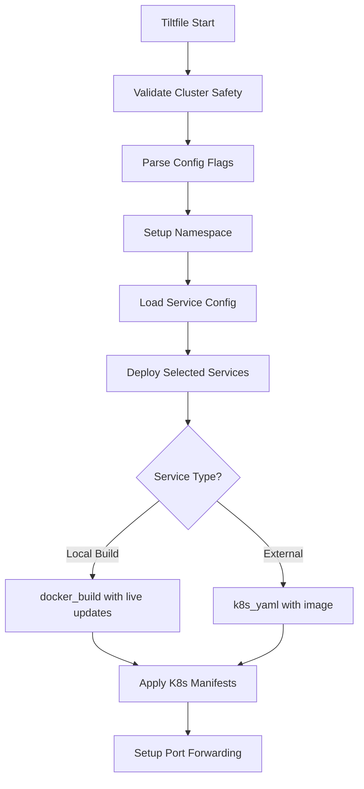

# Tilt Architecture

## Overview

The Tilt implementation follows a simple 3-file architecture for clarity and maintainability.

## Architecture

```
Tiltfile                         # Main orchestration
├── .tilt/config.star           # Configuration parsing
└── .tilt/services.star         # Service deployment logic
```

## Component Responsibilities

### 1. Tiltfile (Main Orchestration)
- Validates cluster safety (prevents production deployments)
- Loads and parses configuration
- Sets up developer namespace
- Orchestrates service deployment
- Manages Tilt UI resources

### 2. config.star (Configuration Module)
```python
# Core functions:
- validate_cluster_safety()    # Ensures safe cluster
- parse_config()               # Parses command-line flags
- setup_namespace()            # Creates developer namespace
- load_environments()          # Loads environment definitions
```

### 3. services.star (Service Deployment)
```python
# Core functions:
- load_service_config()        # Loads service-config.yaml
- deploy_services()            # Main deployment orchestrator
- deploy_service()             # Deploys individual service
- get_live_update_settings()   # Configures live updates
```

## Service Deployment Flow



## Configuration Structure

### Service Configuration (`.tilt/service-config.yaml`)
```yaml
services:
  service-name:
    type: "python|java|go|node|external|crewai"
    build_context: "./path"      # For local builds
    dockerfile: "./path/Dockerfile"  # For local builds
    image: "image:tag"           # For external services
    dependencies: ["service1"]
    ports: [8000]
    env_vars:
      - name: "VAR_NAME"
        value: "value"
    health_check:
      path: "/health"            # HTTP check
      command: ["cmd"]           # Command check
```

### Environment Configuration (`.tilt/environments.yaml`)
```yaml
environments:
  minimal:
    description: "Essential services only"
    services: ["api"]
  backend-only:
    description: "Backend APIs and databases"
    services: ["api", "database", "redis"]
```

## Build Methods

### Local Docker Build
- Triggered when `build_context` and `dockerfile` are present
- Uses `docker_build()` with live updates for Python
- Automatic image naming for Tilt tracking

### External Images
- Triggered when `type: "external"` and `image` are present
- Direct image pull without building
- Used for databases and infrastructure

## Live Updates

Live updates are configured per service type:

```python
# Python services
live_update = [
    sync(build_context + '/', '/app/'),
    # Uvicorn --reload handles restart
]

# Node.js services
live_update = [
    sync(build_context + '/src', '/app/src'),
    sync(build_context + '/package*.json', '/app/'),
    run('npm install', trigger=['package.json'])
]

# Java services
live_update = [
    sync(build_context + '/src', '/app/src'),
    sync(build_context + '/pom.xml', '/app/pom.xml'),
    run('mvn compile', trigger=['pom.xml'])
]

# Go services
live_update = [
    sync(build_context + '/cmd', '/app/cmd'),
    sync(build_context + '/pkg', '/app/pkg'),
    sync(build_context + '/go.*', '/app/'),
    run('go build -o /app/main ./cmd', trigger=['/**/*.go'])
]
```

## Namespace Isolation

Each developer gets an isolated namespace:
```
dev-{developer_id}
```

Benefits:
- No resource conflicts
- Easy cleanup
- Team collaboration without interference

## Safety Features

### Cluster Validation
```python
# Prevents production deployments
allowed_contexts = ["docker-desktop", "minikube", "kind-"]
blocked_contexts = ["prod", "production", "staging"]
```

## Command-Line Interface

### Supported Flags
```bash
--services=service1,service2    # Select services to deploy
--environment=backend-only       # Use predefined environment
--developer_id=username          # Set namespace (default: $USER)
```

## Key Design Principles

1. **Simplicity**: Minimal code with direct implementations
2. **Clarity**: Easy to understand 3-file structure
3. **Fast Feedback**: Live updates for Python services
4. **Safety**: Cluster validation and namespace isolation
5. **Flexibility**: Support for both direct service selection and environments

## Supported Features

- ✅ Service deployment to Kubernetes
- ✅ Live updates for Python (uvicorn)
- ✅ Environment presets
- ✅ Developer namespace isolation
- ✅ Basic dependency management
- ✅ Health checks (HTTP and command)
- ✅ Port forwarding
- ✅ External service support (PostgreSQL, Redis)

## Not Supported

The implementation does not include:
- Runtime configuration overrides
- ECR image registry support
- Dynamic port allocation
- Monitoring dashboards
- Plugin extensibility
- Command-based builds (Maven, Gradle)

These features are not included to maintain simplicity and fast feedback loops.