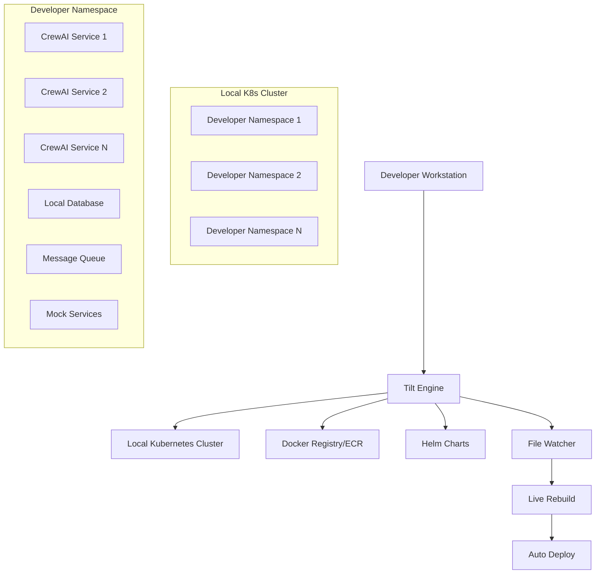

# Design Document

## Overview

The local development environment system will use Tilt as the orchestration layer to manage a local Kubernetes cluster where developers can deploy any combination of applications (Python, Java, Go, Node.js, CrewAI services, etc.). The system will create its own Kubernetes manifests specifically for local development, supports multiple image sources (ECR, local Docker, live builds), and provides isolated namespaces per developer.

## Architecture

### High-Level Architecture



### Component Architecture

1. **Tilt Engine**: Central orchestrator managing builds, deployments, and monitoring
2. **Local Kubernetes Cluster**: Isolated environment using kind/k3d/Docker Desktop
3. **Local Kubernetes Manifests**: Creates development-specific Kubernetes manifests or simple Helm charts
4. **Image Management**: Handles ECR pulls, local builds, and Docker registry integration
5. **Developer Isolation**: Namespace-based isolation with resource quotas
6. **Service Discovery**: Kubernetes-native service discovery and networking

## Components and Interfaces

### Tilt Configuration (Tiltfile)

The main Tiltfile will serve as the entry point for the development environment using Tilt best practices:

```python
# Main Tiltfile structure
load('ext://namespace', 'namespace_create')
load('ext://configmap', 'configmap_create')
load('ext://secret', 'secret_create_generic')

# Configuration using Tilt's config system
config.define_string_list("services", args=True, usage="List of services to deploy")
config.define_string("developer_id", args=False, usage="Developer identifier for namespace isolation")
config.define_string("cluster_type", args=False, usage="Local cluster type: kind|k3d|docker-desktop")
config.define_bool("enable_debug", args=False, usage="Enable debug mode with verbose logging")

cfg = config.parse()

# Set defaults
developer_id = cfg.get("developer_id", os.environ.get("USER", "dev"))
developer_namespace = "dev-" + developer_id
services_to_deploy = cfg.get("services", [])
debug_mode = cfg.get("enable_debug", False)

# Load service configurations
service_configs = read_yaml('.tilt/service-config.yaml')

# Create isolated namespace with proper labels
namespace_create(
    developer_namespace,
    labels=['tilt.dev/developer=' + developer_id, 'tilt.dev/environment=local']
)

# Deploy services based on configuration
for service_name in services_to_deploy:
    if service_name in service_configs['services']:
        deploy_service(service_name, service_configs['services'][service_name], developer_namespace)
    else:
        fail("Service '{}' not found in service-config.yaml".format(service_name))

# Add resource dependencies and ordering
if len(services_to_deploy) > 1:
    # Ensure proper startup order based on dependencies
    setup_service_dependencies(services_to_deploy, service_configs)
```

### Service Configuration Schema

Each application will have a configuration file defining deployment options for different technology stacks:

```yaml
# .tilt/service-config.yaml
services:
  # Python CrewAI Service
  ai-agentic-mdr-oscar:
    type: "python"
    build_context: "./ai-agentic-mdr-oscar"
    dockerfile: "./ai-agentic-mdr-oscar/Dockerfile"
    ecr_image: "123456789.dkr.ecr.us-east-1.amazonaws.com/ai-agentic-mdr-oscar"
    dependencies: ["database", "redis"]
    ports: [8080, 8081]
    env_vars:
      - name: "LOG_LEVEL"
        value: "DEBUG"
      - name: "ENVIRONMENT"
        value: "local"
    resources:
      cpu: "500m"
      memory: "512Mi"
    
  # Java Spring Boot Service
  user-management-service:
    type: "java"
    build_context: "./user-management-service"
    dockerfile: "./user-management-service/Dockerfile"
    ecr_image: "123456789.dkr.ecr.us-east-1.amazonaws.com/user-management-service"
    dependencies: ["database"]
    ports: [8090]
    env_vars:
      - name: "SPRING_PROFILES_ACTIVE"
        value: "local"
      - name: "LOG_LEVEL"
        value: "DEBUG"
    resources:
      cpu: "1000m"
      memory: "1Gi"
    
  # Go Microservice
  api-gateway:
    type: "go"
    build_context: "./api-gateway"
    dockerfile: "./api-gateway/Dockerfile"
    ecr_image: "123456789.dkr.ecr.us-east-1.amazonaws.com/api-gateway"
    dependencies: ["user-management-service"]
    ports: [8000]
    env_vars:
      - name: "LOG_LEVEL"
        value: "debug"
      - name: "ENV"
        value: "local"
    resources:
      cpu: "250m"
      memory: "256Mi"
      
  # Node.js Service
  notification-service:
    type: "nodejs"
    build_context: "./notification-service"
    dockerfile: "./notification-service/Dockerfile"
    ecr_image: "123456789.dkr.ecr.us-east-1.amazonaws.com/notification-service"
    dependencies: ["redis"]
    ports: [3000]
    env_vars:
      - name: "NODE_ENV"
        value: "development"
      - name: "LOG_LEVEL"
        value: "debug"
    resources:
      cpu: "250m"
      memory: "256Mi"
```

### Kubernetes Manifest Generation

Tilt will generate Kubernetes manifests dynamically using Tilt's built-in functions and extensions:

```python
def generate_k8s_manifests(service_name, service_config, namespace, image_name):
    """Generate Kubernetes manifests using Tilt's templating capabilities"""
    
    # Use Tilt's built-in YAML generation
    deployment_yaml = """
apiVersion: apps/v1
kind: Deployment
metadata:
  name: {service_name}
  namespace: {namespace}
  labels:
    app: {service_name}
    tilt.dev/resource: {service_name}
spec:
  replicas: 1
  selector:
    matchLabels:
      app: {service_name}
  template:
    metadata:
      labels:
        app: {service_name}
    spec:
      containers:
      - name: {service_name}
        image: {image_name}
        ports: {ports}
        env: {env_vars}
        resources: {resources}
        livenessProbe:
          httpGet:
            path: /health
            port: {main_port}
          initialDelaySeconds: 30
          periodSeconds: 10
        readinessProbe:
          httpGet:
            path: /ready
            port: {main_port}
          initialDelaySeconds: 5
          periodSeconds: 5
---
apiVersion: v1
kind: Service
metadata:
  name: {service_name}
  namespace: {namespace}
  labels:
    app: {service_name}
spec:
  selector:
    app: {service_name}
  ports: {service_ports}
  type: ClusterIP
""".format(
        service_name=service_name,
        namespace=namespace,
        image_name=image_name,
        ports=format_container_ports(service_config.get("ports", [])),
        env_vars=format_env_vars(service_config.get("env_vars", [])),
        resources=format_resources(service_config.get("resources", {})),
        main_port=service_config.get("ports", [8080])[0],
        service_ports=format_service_ports(service_config.get("ports", []))
    )
    
    return deployment_yaml

# Helper functions for YAML formatting
def format_container_ports(ports):
    return [{"containerPort": port} for port in ports]

def format_env_vars(env_vars):
    return [{"name": env["name"], "value": env["value"]} for env in env_vars]

def format_resources(resources):
    if not resources:
        return {"requests": {"cpu": "100m", "memory": "128Mi"}}
    return {
        "requests": {"cpu": "100m", "memory": "128Mi"},
        "limits": resources
    }

def format_service_ports(ports):
    return [{"name": f"port-{port}", "port": port, "targetPort": port} for port in ports]
```

### Service Deployment Functions

```python
def deploy_service(service_name, service_config, namespace):
    """Deploy a service using Tilt best practices"""
    
    # Determine build strategy
    build_locally = config.tilt_subcommand == 'up' and service_name in cfg.get("build_local", [])
    
    if build_locally:
        # Local build with optimized live updates
        image_name = service_name + ":latest"
        
        # Language-specific live update configurations
        live_updates = get_live_updates_for_type(service_config.get("type", "generic"))
        
        docker_build(
            image_name,
            service_config["build_context"],
            dockerfile=service_config.get("dockerfile", "Dockerfile"),
            live_update=live_updates,
            # Use build args for local development
            build_args={"ENV": "local", "DEBUG": "true"}
        )
    else:
        # Use ECR image - Tilt will handle pulling
        image_name = service_config["ecr_image"]
    
    # Generate and apply Kubernetes manifests
    manifests = generate_k8s_manifests(service_name, service_config, namespace, image_name)
    k8s_yaml(manifests)
    
    # Configure the k8s resource with proper settings
    k8s_resource(
        service_name,
        port_forwards=[str(port) + ":" + str(port) for port in service_config.get("ports", [])],
        resource_deps=service_config.get("dependencies", []),
        labels=["app:" + service_name, "type:" + service_config.get("type", "generic")]
    )

def get_live_updates_for_type(app_type):
    """Return optimized live update rules based on application type"""
    if app_type == "python":
        return [
            sync('./src', '/app/src'),
            sync('./requirements.txt', '/app/requirements.txt'),
            run('pip install -r requirements.txt', trigger=['requirements.txt']),
            restart_container()
        ]
    elif app_type == "java":
        return [
            sync('./target/classes', '/app/classes'),
            restart_container()
        ]
    elif app_type == "go":
        return [
            sync('./cmd', '/app/cmd'),
            sync('./pkg', '/app/pkg'),
            run('go build -o /app/main ./cmd', trigger=['./cmd/**/*.go', './pkg/**/*.go']),
            restart_container()
        ]
    elif app_type == "nodejs":
        return [
            sync('./src', '/app/src'),
            sync('./package.json', '/app/package.json'),
            run('npm install', trigger=['package.json']),
            restart_container()
        ]
    else:
        return [restart_container()]

def setup_service_dependencies(services, service_configs):
    """Configure service startup dependencies"""
    for service_name in services:
        service_config = service_configs['services'][service_name]
        deps = service_config.get("dependencies", [])
        
        # Only add dependencies that are also being deployed
        active_deps = [dep for dep in deps if dep in services]
        
        if active_deps:
            k8s_resource(service_name, resource_deps=active_deps)
```

## Data Models

### Developer Environment Configuration

```yaml
# .tilt/developer-config.yaml
developer:
  id: "john-doe"
  namespace: "dev-john-doe"
  
cluster:
  type: "kind"  # kind|k3d|docker-desktop
  name: "tilt-dev"
  
services:
  enabled:
    - ai-agentic-mdr-oscar
    - ai-agentic-leql-generator
  
  build_locally:
    - ai-agentic-mdr-oscar  # Build from source
  
  use_ecr:
    - ai-agentic-leql-generator  # Use ECR image
    
resources:
  namespace_quota:
    cpu: "4"
    memory: "8Gi"
    storage: "20Gi"
```

### Service Dependency Graph

```python
# Service dependency resolution
dependencies = {
    "ai-agentic-mdr-oscar": ["database", "redis"],
    "ai-agentic-leql-generator": ["database"],
    "ai-agentic-test-app": ["database", "redis", "ai-agentic-mdr-oscar"]
}

def get_deployment_order(requested_services):
    """Topological sort of service dependencies"""
    # Implementation returns ordered list for deployment
    pass
```

## Error Handling

### Build Failures

1. **Docker Build Errors**: Tilt displays build logs in real-time with error highlighting
2. **Dependency Resolution**: Clear error messages when dependencies are missing
3. **Resource Constraints**: Warnings when local cluster resources are insufficient
4. **Image Pull Failures**: Retry logic with exponential backoff for ECR pulls

### Deployment Failures

1. **Helm Chart Errors**: Validation of Helm charts before deployment
2. **Kubernetes Resource Conflicts**: Automatic cleanup and retry mechanisms
3. **Service Startup Failures**: Health check monitoring with restart policies
4. **Network Issues**: Port conflict detection and resolution

### Recovery Mechanisms

```python
# Tilt error handling patterns
def deploy_with_retry(service_name, max_retries=3):
    for attempt in range(max_retries):
        try:
            deploy_service(service_name)
            break
        except Exception as e:
            if attempt == max_retries - 1:
                fail(f"Failed to deploy {service_name} after {max_retries} attempts: {e}")
            print(f"Deployment attempt {attempt + 1} failed, retrying...")
            time.sleep(2 ** attempt)  # Exponential backoff
```

## Testing Strategy

### Local Environment Validation

1. **Cluster Health Checks**: Automated verification of Kubernetes cluster status
2. **Service Connectivity Tests**: Validation of inter-service communication
3. **Resource Monitoring**: Continuous monitoring of CPU, memory, and storage usage
4. **Configuration Validation**: Pre-deployment validation of Helm charts and Tilt configuration

### Integration Testing Support

1. **Test Data Management**: Automated setup of test databases and seed data
2. **Mock Service Deployment**: Configurable mock services for external dependencies
3. **Environment Reset**: Quick environment cleanup and reset capabilities
4. **Debugging Support**: Port-forwarding and log aggregation for troubleshooting

### Performance Monitoring

```yaml
# Tilt resource monitoring configuration
resources:
  - name: "resource-monitor"
    cmd: |
      kubectl top nodes
      kubectl top pods -n $NAMESPACE
    interval: 30s
    
  - name: "service-health"
    cmd: |
      kubectl get pods -n $NAMESPACE -o wide
      kubectl get services -n $NAMESPACE
    interval: 10s
```

This design provides a comprehensive foundation for the Tilt-based local development environment, ensuring developer productivity while maintaining production parity through Helm chart reuse and proper isolation mechanisms.